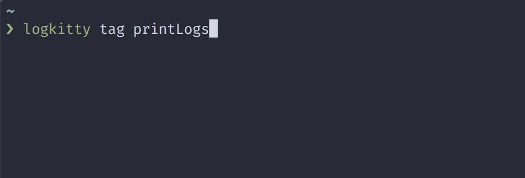

# logkitty

[![Version][version]][package]   

[![PRs Welcome][prs-welcome-badge]][prs-welcome]
[![MIT License][license-badge]][license]
[![Chat][chat-badge]][chat]
[![Code of Conduct][coc-badge]][coc]

Display __pretty__ Logcat logs __without Android Studio__ with __intuitive__ Command Line Interface.



## Installation

```bash
yarn global add logkitty
```

Or if you prefer having it locally:

```
yarn add -D logkitty
yarn logkitty --help
```

## Usage

```bash
logkitty <command> [options]
```

### Commands

* `tag <tags...>` - Show logs with matching tags.
* `app <appId>` - Show logs from application with given identifier.
* `match <regexes...>` - Show logs matching given patterns (all regexes have flags `g` and `m`).
* `custom <patterns...>` - Use custom [patters supported by Logcat](https://developer.android.com/studio/command-line/logcat#filteringOutput).
* `all` - Show all logs.

### Options

#### Common

All command accept the following options:

* `--adb-path <path>` - Custom path to ADB executable/binary.
* `-h, --help` - Display help
* `-v, --version` - Display version

#### Specific

`tag`, `app`, `match` and `all` commands support additional filtering options (sorted by priority):

* `-U, -u` - Unknown priority (lowest)
* `-v, -v` - Verbose priority
* `-D, -d` - Debug priority (default)
* `-I, -i` - Info priority
* `-W, -w` - Warn priority
* `-E, -e` - Error priority
* `-F, -f` - Fatal priority
* `-S, -s` - Silent priority (highest)

For example `logkitty all -W` will display all logs with priority __warn__, __error__ and __fatal__.

### Examples

Show all logs with tag `ReactNativeJS` (and default priority - __debug and above__):

```
logkitty tag ReactNativeJS
```

Show all logs with priority __info and above__ from application with identifier `com.example.myApplication`:

```
logkitty app com.example.myApplication -i
```

Show all logs matching `/CodePush/gm` regex:

```
logkitty match CodePush
```

Show all logs with priority __error__ or __fatal__:

```
logkitty all -e
```

Show logs using custom patterns - silence all logs and display only the onces with tag `my-tag` and priority __debug and above__:

```
logkitty custom *:S my-tag:D
```

## Node API

### Example: 
```ts
import {
  logkitty,
  makeTagsFilter,
  formatEntry,
  formatError,
  Priority,
  Entry,
} from 'logkitty';

const emitter = logkitty({
  platform: 'android',
  minPriority: Priority.VERBOSE,
  filter: makeTagsFilter('ReactNative', 'ReactNativeJS'),
});

emitter.on('entry', (entry: Entry) => {
  console.log(formatEntry(entry));
});

emitter.on('error', (error: Error) => {
  console.log(formatError(error));
});
```

#### `logkitty(options: LogkittyOptions): EventEmitter`

Spawns logkitty with given options:

* `platform: 'android'` - Platform, currently the only supported one is `android`.
* `adbPath?: string` - Custom path to ADB tool or `undefined`.
* `priority?: number` - Minimum priority of entries to show of `undefined`, which will include all entries with priority **DEBUG** or above.
* `filter?: FilterCreator` - The returned value from `makeTagsFilter`/`makeAppFilter`/`makeMatchFilter`/`makeCustomFilter` or `undefined`, which will include all entries (similar to `all` command in the CLI).

When spawning logkitty you will get a instance of `EventEmitter` which emitts the following events:

* `entry` (arguments: `entry: Entry`) - Emitted when new log comes in, that matches the `filter` and `priority` options. It is your responsibility to print or use that entry, for example you can use `formatEntry` to print it with the same styling as in the CLI.
* `error` (arguments: `error: Error`) - Emitted when the log can't be parsed into a entry or when the Logcat process emits an error. You can use `formatError` to print it with the same styling as in the CLI.

#### `makeTagsFilter(...tags: string[]): FilterCreator`

Creates a filter from given tags (for example `ReactNative`, `ReactNativeJS`), so only entries matching any of the given tags will be emitted in `entry` event. Pass the returned value to `filter` property when running `logkitty`.

#### `makeAppFilter(appIdentifier: string): FilterCreator`

Creates a filter for given application identifier (for example `com.example.app`), so only entries from given app will be emitted in `entry` event. Pass the returned value to `filter` property when running `logkitty`.


#### `makeMatchFilter(...regexes: RegExp[]): FilterCreator`

Creates a filter from given regexes (for example `/ReactNative/gm`, `/ReactNativeJS/gm`), so only entries matching any of the given regexes will be emitted in `entry` event. Pass the returned value to `filter` property when running `logkitty`.

#### `makeCustomFilter(...patterns: string[]): FilterCreator`

Creates a custom filter (for example `*:S`, `ReactNative:D`, `Hello:E`), so only entries matching given patterns will be emitted in `entry` event. Pass the returned value to `filter` property when running `logkitty`.

#### `formatEntry(entry: Entry): string`

Takes an entry as formats it to a string with ANSI escape codes for coloring.

#### `formatError(error: Error): string`

Takes an error and formats it to a string with ANSI escape codes for coloring.


<!-- badges (common) -->

[license-badge]: https://img.shields.io/npm/l/logkitty.svg?style=flat-square
[license]: https://opensource.org/licenses/MIT
[prs-welcome-badge]: https://img.shields.io/badge/PRs-welcome-brightgreen.svg?style=flat-square
[prs-welcome]: http://makeapullrequest.com
[coc-badge]: https://img.shields.io/badge/code%20of-conduct-ff69b4.svg?style=flat-square
[coc]: https://github.com/zamotany/logkitty/blob/master/CODE_OF_CONDUCT.md
[chat-badge]: https://img.shields.io/badge/chat-discord-brightgreen.svg?style=flat-square&colorB=7289DA&logo=discord
[chat]: https://discord.gg/zwR2Cdh

[version]: https://img.shields.io/npm/v/logkitty.svg?style=flat-square
[package]: https://www.npmjs.com/package/logkitty
